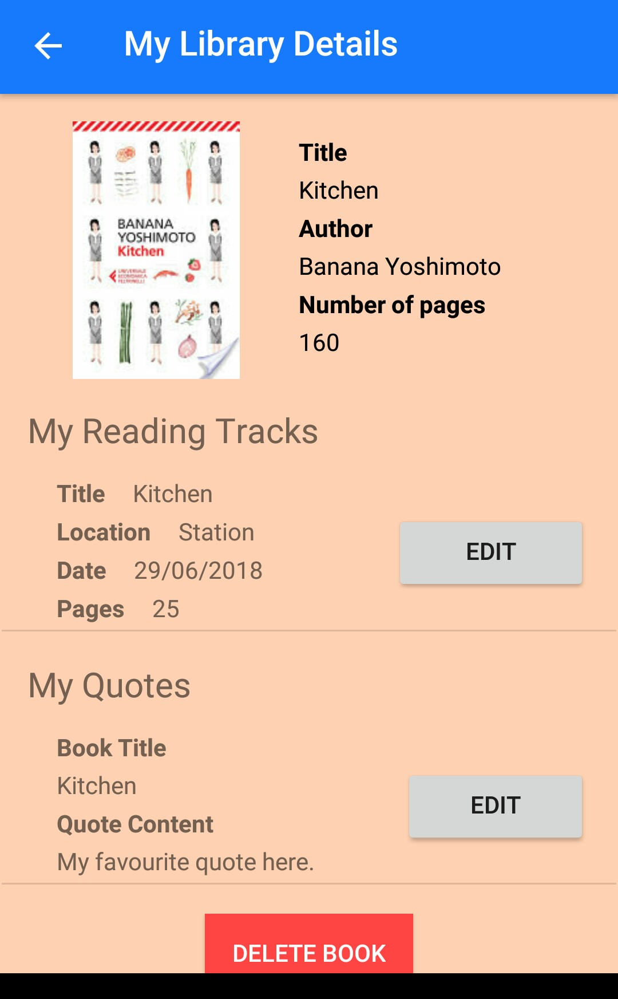

# BookCompanion
Final CapStoneProject BookCompanion for Android Advance Udacity Nanodegree

 

This project has been the final test fot getting the Udacity Advanced Android Development Nanodegree.

The app is designed for all the Book Lovers (like me) and has simple activities to store a digital library, reading track sessione and add
favourite quotes. The idea is to create a companion for tracking all the activities of a reader.

From a development point of view, the App is designed for me as I've used this project to review all the learning of the Nanodegree and the
file structure is based on my personal learning needs (rather than common development convention).

Talking specifically, the app has 3 DBs, 1 using Loaders and Content provider and the other 2 developed in order to understand the usage of 
AAC.

In the meanwhile there are usages of google services (maps, location, mobaile adds...) and some of the most common libraries 
(ButterKnife for binding view, Retrofit for managing APIs, Picasso for loading the Book images...)

Message me for further explainations, and if you like the idea stay tuned for further development (I might not be sharing updates, 
but the app might be published in a more profesionall version very soon).
